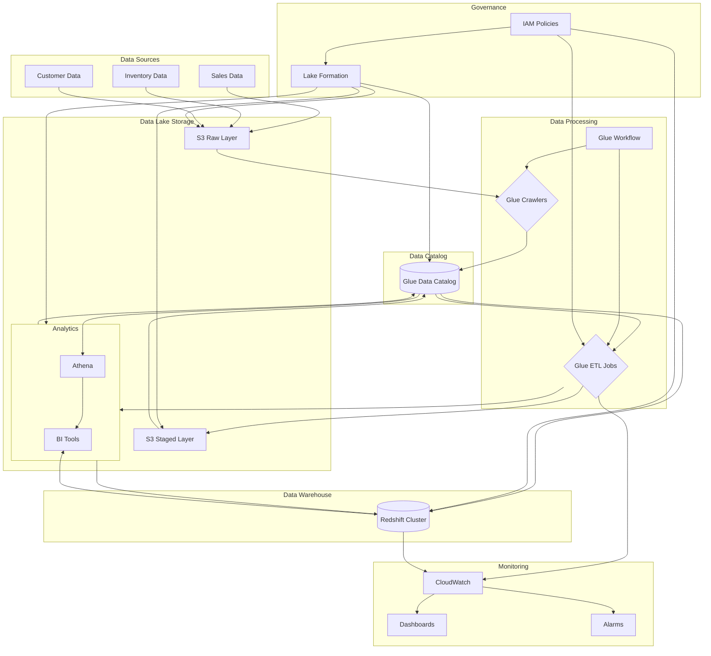

# Retail Analytics Data Lake & Warehouse - Terraform Implementation

This project provides a comprehensive Terraform implementation to deploy a complete retail analytics data lake and warehouse solution using AWS Lake Formation and related services. The infrastructure is provisioned as code, enabling consistent and repeatable deployments across environments.

## Architecture Overview

The architecture follows a modern data lake approach with layered storage, centralized governance, automated ETL processing, and integrated analytics capabilities.

### Data Flow Diagram



## Components and Services

### 1. Storage Layer (Amazon S3)
The solution uses S3 buckets organized into three distinct layers:
- **Raw Zone**: Landing area for source data in its original format
- **Staged Zone**: Cleaned, validated, and transformed data
- **Analytics Zone**: Business-ready datasets optimized for analysis

### 2. Metadata and Catalog (AWS Glue Data Catalog)
AWS Glue Data Catalog serves as the central metadata repository:
- Tables and databases for each data layer
- Schema information for all datasets
- Partition details for optimized querying
- Technical metadata (data types, formats, etc.)

### 3. Data Processing (AWS Glue)
AWS Glue provides the ETL capabilities:
- **Crawlers**: Automatically discover and catalog data schemas
- **ETL Jobs**: Transform data between layers using Spark-based processing
- **Workflow**: Orchestrate the end-to-end data processing pipeline
- **Triggers**: Schedule or event-based execution of jobs and crawlers

### 4. Data Warehouse (Amazon Redshift)
Amazon Redshift serves as the analytical data warehouse:
- High-performance SQL querying
- Integration with the data lake via Redshift Spectrum
- Optimization for analytical workloads
- Support for business intelligence tools

### 5. Governance (AWS Lake Formation)
AWS Lake Formation provides centralized data lake management:
- Fine-grained access control at database, table, column levels
- Central permission management
- Data location registration
- Integration with IAM for identity-based policies

### 6. Security (IAM, Encryption)
The solution implements multiple security controls:
- IAM roles with least privilege principles
- Encryption at rest for all data in S3 and Redshift
- VPC security groups for network isolation
- SSL/TLS for data in transit

### 7. Monitoring (CloudWatch)
CloudWatch provides operational visibility:
- Custom dashboards for data lake and warehouse monitoring
- Alarms for job failures and performance issues
- Log collection and analysis
- Notification integration

## Detailed Process Flow

1. **Data Ingestion Phase**
   - Source data is uploaded to designated folders in the raw S3 bucket
   - Folders are organized by data source (sales, inventory, customers)
   - Data can be in various formats (CSV, JSON, Parquet)

2. **Data Discovery Phase**
   - Scheduled Glue crawlers scan the raw buckets
   - Schemas are detected and registered in the Glue Data Catalog
   - Tables are created in the "raw" database

3. **Data Transformation Phase**
   - ETL jobs are triggered after crawlers complete
   - Raw data is read based on catalog metadata
   - Transformation logic is applied (cleaning, normalization, enrichment)
   - Processed data is written to the staged bucket in Parquet format
   - Partitioning is applied for performance optimization

4. **Analytics Preparation Phase**
   - Analytics aggregation job combines data from staged tables
   - Business metrics and KPIs are calculated
   - Aggregated results are written to the analytics bucket
   - Data is optimized for analytical queries

5. **Data Consumption Phase**
   - Redshift Spectrum connects to the data catalog
   - External schemas are created for the analytics data
   - Business users query data via SQL
   - BI tools connect to Redshift for visualization

## Terraform Implementation

### Module Structure

The Terraform code is organized into functional modules:

- **S3 Module**: Creates and configures all data lake buckets
- **IAM Module**: Sets up all necessary roles and policies
- **Lake Formation Module**: Configures Lake Formation settings and permissions
- **Glue Module**: Creates all ETL resources (crawlers, jobs, workflows)
- **Redshift Module**: Provisions and configures the data warehouse
- **Monitoring Module**: Sets up CloudWatch dashboards and alarms

### Deployment Process

To deploy the solution:

1. **Prepare Environment**:
   - Ensure AWS CLI is configured with appropriate credentials
   - Install Terraform v1.0.0 or higher
   - Prepare an existing VPC with subnets for Redshift

2. **Configure Variables**:
   - Update `terraform.tfvars` with environment-specific values
   - Set appropriate resource sizing based on workload
   - Configure security parameters (IP ranges, admin users)

3. **Initialize Terraform**:
   ```bash
   terraform init
   ```

4. **Review Plan**:
   ```bash
   terraform plan -out=tfplan
   ```

5. **Apply Configuration**:
   ```bash
   terraform apply tfplan
   ```

6. **Verify Deployment**:
   - Check the AWS Console to verify all components
   - Review CloudWatch dashboards for monitoring
   - Test data ingestion and processing flow

## ETL Scripts Details

The solution includes several Python-based Glue ETL scripts:

1. **transform_sales.py**:
   - Processes raw sales data
   - Cleans and validates sales records
   - Calculates derived fields (total price, discounts)
   - Partitions by year and month

2. **transform_inventory.py**:
   - Processes inventory data
   - Normalizes product information
   - Calculates inventory metrics
   - Handles historical inventory tracking

3. **transform_customers.py**:
   - Processes customer data
   - Anonymizes personally identifiable information (PII)
   - Creates customer segments
   - Handles address normalization

4. **analytics_aggregation.py**:
   - Joins sales, inventory, and customer data
   - Calculates business KPIs
   - Creates aggregated views for reporting
   - Optimizes for analytical query patterns

## Governance and Security

### Lake Formation Permission Design

The solution implements a comprehensive permission model:
- Data lake admin has full control
- Glue service role has processing permissions
- Redshift role has selective read access
- Analyst roles have query-only access to business data

### Data Encryption

All data is encrypted:
- S3 buckets use AES-256 encryption
- Redshift cluster uses AWS-managed keys
- Data in transit uses TLS

### Auditing and Compliance

The infrastructure supports auditing:
- CloudTrail logs all API calls
- Lake Formation logs record access patterns
- Redshift logs capture query history
- CloudWatch Logs capture processing information

## Cost Optimization

The solution implements several cost-optimization measures:

1. **Storage Optimization**:
   - Lifecycle policies for transitioning older data
   - Compression for reduced storage costs
   - Partitioning for query efficiency

2. **Processing Optimization**:
   - Right-sized Glue workers
   - Job bookmarks to prevent reprocessing
   - Optimized Spark configurations

3. **Compute Optimization**:
   - Appropriately sized Redshift cluster
   - Serverless query options with Athena
   - Query optimization for performance

## Operational Considerations

### Monitoring Strategy

The solution includes comprehensive monitoring:
- ETL job success/failure tracking
- Processing time metrics
- Resource utilization dashboards
- Cost allocation tracking

### Alerting Strategy

Alerts are configured for:
- Failed ETL jobs
- High Redshift CPU utilization
- Excessive Redshift disk usage
- Long-running queries

### Backup and Recovery

The infrastructure supports data protection:
- S3 versioning for data recovery
- Redshift automated snapshots
- Catalog backup via AWS Backup

## Scaling Considerations

The architecture is designed to scale:
- Horizontal scaling for Redshift (add nodes)
- Vertical scaling for Glue jobs (larger worker types)
- Partitioning strategy for large datasets
- Separation of storage and compute

## Getting Started with Sample Data

To test the solution with sample data:

1. Deploy the infrastructure using Terraform
2. Upload sample data to the appropriate raw folders:
   - `s3://<raw-bucket>/sales/`
   - `s3://<raw-bucket>/inventory/`
   - `s3://<raw-bucket>/customers/`
3. Run the Glue workflow manually or wait for the schedule
4. Connect to Redshift and run sample queries

## Conclusion

This Terraform implementation provides a complete, production-ready retail analytics data lake and warehouse solution. It follows AWS best practices for data lakes using Lake Formation, maintaining security, governance, and performance while enabling flexible analytics capabilities.

The modular Terraform approach allows for customization and extension to meet specific business requirements while maintaining a consistent architecture pattern.

## License

This project is licensed under the MIT License - see the LICENSE file for details.